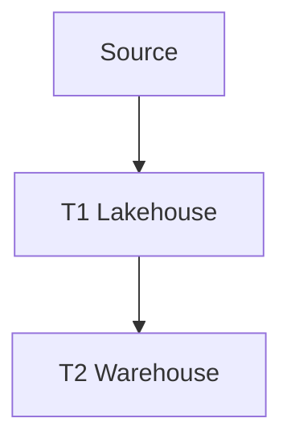

# Architecture Diagrams

This folder contains visual representations of the T0-T5 architecture pattern.

## Available Diagrams

### Architecture Overview
- **File**: `architecture-overview.md` (Mermaid diagram)
- **Description**: High-level T0-T5 architecture flow
- **Use Case**: Understanding overall data flow

### Data Flow Diagram
- **File**: `data-flow.md` (Mermaid diagram)
- **Description**: Detailed data flow through all layers
- **Use Case**: Understanding data movement and transformations

### Technology Stack
- **File**: `technology-stack.md` (Mermaid diagram)
- **Description**: Technology mapping to each layer
- **Use Case**: Understanding which tools are used where

## Creating Diagrams

Diagrams are created using Mermaid syntax for easy rendering in GitHub and markdown viewers.

**Example Mermaid diagram:**

## Related Documentation

- [Architecture Pattern](../architecture/architecture-pattern.md) - Detailed implementation guide
- [Pattern Summary](../architecture/pattern-summary.md) - High-level overview
