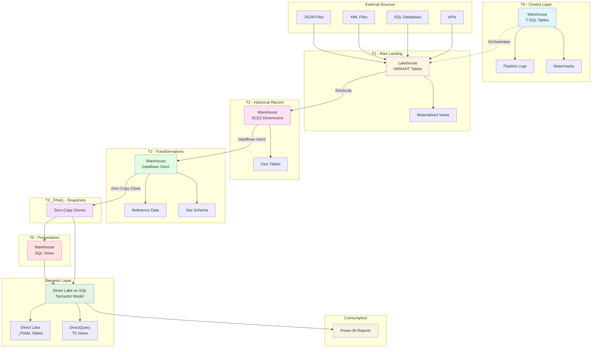

# T0-T5 Architecture Overview

## High-Level Architecture Flow

## Key Components

### T0 - Control Layer
- Pipeline orchestration metadata
- Execution logs
- Watermark tracking
- Configuration tables

### T1 - Raw Landing
- VARIANT columns for schema flexibility
- Materialized views for performance
- Transient layer (truncated after T2)

### T2 - Historical Record
- SCD2 dimensions with full history
- Fact tables with incremental loading
- T-SQL stored procedures

### T3 - Transformations
- Dataflows Gen2 for all transformations
- Reference data tables
- Star schema creation

### T3._FINAL - Snapshots
- Zero-copy clones
- Isolated from T3 failures
- Stable for semantic layer

### T5 - Presentation
- SQL views only
- Business-friendly naming
- RLS-ready

### Semantic Layer
- Direct Lake on SQL endpoints
- Automatic DirectQuery fallback
- Single Warehouse source

## Related Documentation

- [Architecture Pattern](../architecture/architecture-pattern.md) - Detailed implementation guide
- [Pattern Summary](../architecture/pattern-summary.md) - High-level overview
