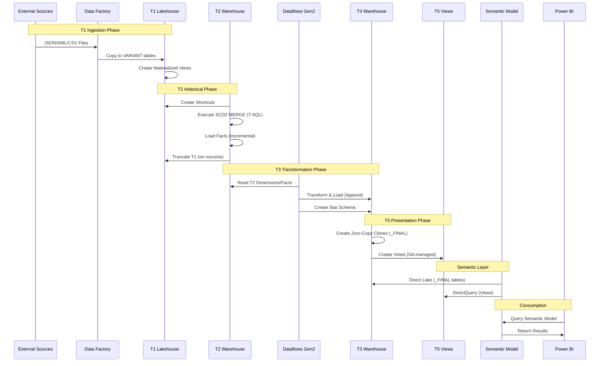
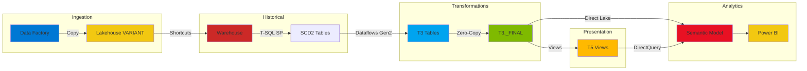

# Data Flow Diagram

## Detailed Data Flow Through T0-T5 Layers

## Technology Flow

## Related Documentation

- [Architecture Pattern](../architecture/architecture-pattern.md) - Detailed implementation guide
- [Data Factory Patterns](../patterns/data-factory-patterns.md) - T1 ingestion patterns
- [Dataflows Gen2 Patterns](../patterns/dataflows-gen2-patterns.md) - T3 transformation patterns
