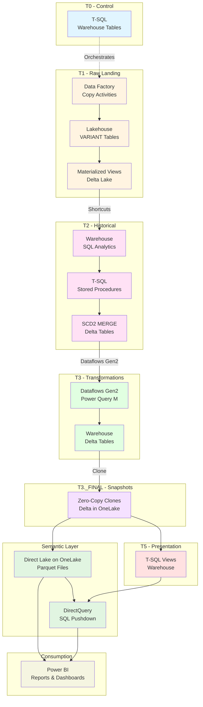

# Technology Stack Diagram

## Technology Mapping to T0-T5 Layers

## Technology by Layer

| Layer | Primary Technology | Secondary Technology | Purpose |
|-------|-------------------|---------------------|---------|
| T0 | T-SQL | Warehouse | Control & orchestration |
| T1 | Data Factory | Lakehouse (Delta) | Raw data ingestion |
| T2 | T-SQL | Warehouse (Delta) | Historical record (SCD2) |
| T3 | Dataflows Gen2 | Warehouse (Delta) | Transformations |
| T3._FINAL | Zero-Copy Clone | Delta in OneLake | Validated snapshots |
| T5 | T-SQL Views | Warehouse | Presentation layer |
| Semantic | Direct Lake on OneLake | OneLake Parquet files | Analytics consumption |

## Related Documentation

- [Technology Distinctions](../reference/technology-distinctions.md) - Data Factory vs Dataflows Gen2
- [Architecture Pattern](../architecture/architecture-pattern.md) - Detailed implementation guide
